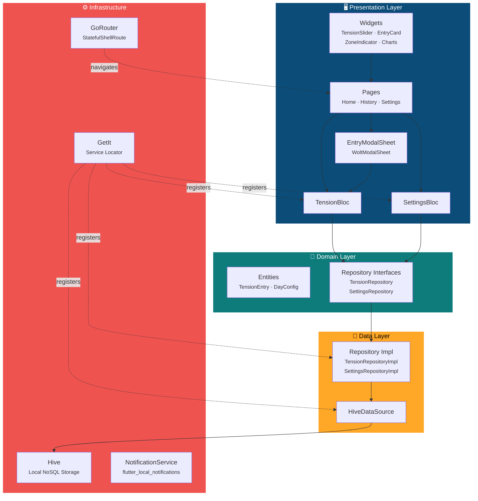
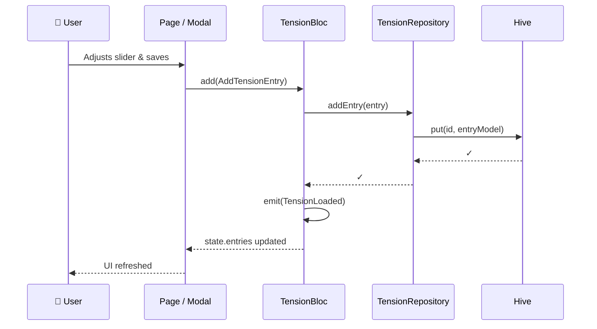
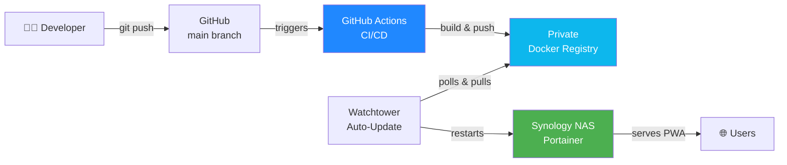

<div align="center">
  

# Untense

### **Untense your system**

[](https://flutter.dev)
[](https://dart.dev)
[]()
[]()
[]()

> **A therapeutic tension diary app** — empowering patients & therapists to track, reflect and regulate emotional tension levels throughout the day using the three therapeutic zones: *Mindfulness*, *Emotion Regulation* and *Stress Tolerance*.

---

[Features](#-features) · [Architecture](#-architecture) · [Getting Started](#-getting-started) · [Deployment](#-deployment) · [Tech Stack](#-tech-stack) · [Project Structure](#-project-structure) · [Contributing](#-contributing)

</div>

---

## ✨ Features

### 📊 Core Tracking
| Feature | Description |
|---------|-------------|
| **Tension Slider** | Custom zone-coloured slider (0–100) with real-time zone feedback |
| **Zone Indicator** | Visual feedback across three therapeutic zones: 🟢 Mindfulness (0–30), 🟠 Emotion Regulation (30–70), 🔴 Stress Tolerance (70–100) |
| **Rich Entries** | Record situation, feelings, notes and select from 18 emotions per entry |
| **Date/Time Pickers** | Full control over entry timestamps — including past entries |
| **Modal Sheet Add/Edit** | Responsive `WoltModalSheet` — bottom sheet on mobile, dialog on desktop |

### 📈 History & Analytics
| Feature | Description |
|---------|-------------|
| **Multi-View History** | Switch between Day / Week / Month / Year views |
| **Interactive Charts** | Beautiful `fl_chart` tension curves with touch-tracking |
| **Aggregated Charts** | Daily averages aggregated over week/month/year periods |
| **Statistics Row** | Average (Ø), Max (↑), Min (↓) and Count (#) per view |
| **Period Pickers** | Tap-to-select for week, month and year periods |

### 🎨 Design & UX
| Feature | Description |
|---------|-------------|
| **Liquid Glass Navigation** | Frosted-glass bottom navigation bar with `BackdropFilter` |
| **Responsive Layout** | Bottom nav on mobile/tablet (< 840dp), `NavigationRail` on desktop |
| **Dark & Light Themes** | Full dark mode support with Material Design 3 |
| **Native Splash Screen** | Branded splash with logo, animated loading bar, dark mode variant |
| **Custom App Icons** | Generated for Android (adaptive), iOS and Web/PWA |

### 🌐 Internationalisation
| Feature | Description |
|---------|-------------|
| **i18next** | Full translation support |
| **Languages** | 🇬🇧 English, 🇩🇪 German |
| **Emotion Labels** | All 18 emotion chips translated |

### 💾 Data & Privacy
| Feature | Description |
|---------|-------------|
| **100% Offline** | All data stored locally with Hive — no cloud, no accounts |
| **JSON Export/Import** | Full data portability via file picker |
| **Share Support** | Share exported data via system share sheet |
| **No Telemetry** | Zero analytics, zero tracking — your diary stays yours |

### 🔔 Notifications
| Feature | Description |
|---------|-------------|
| **Configurable Reminders** | Interval-based reminders between custom day start/end times |
| **Timezone-Aware** | Correct scheduling via `timezone` package |

---

## 🏗 Architecture

The app follows **Clean Architecture** with a strict layer separation:

```
┌──────────────────────────────────────────────────┐
│                  Presentation                     │
│   Pages · Widgets · BLoC (State Management)       │
├──────────────────────────────────────────────────┤
│                    Domain                         │
│      Entities · Repository Interfaces             │
├──────────────────────────────────────────────────┤
│                     Data                          │
│  Repository Impls · Data Sources · Models         │
├──────────────────────────────────────────────────┤
│                 Infrastructure                    │
│     Hive (Local DB) · Notifications · DI          │
└──────────────────────────────────────────────────┘
```



### Data Flow



---

## 🚀 Getting Started

### Prerequisites

| Tool | Version | Install |
|------|---------|---------|
| Flutter SDK | ≥ 3.10.8 | [flutter.dev/docs/get-started](https://docs.flutter.dev/get-started/install) |
| Dart SDK | ≥ 3.10.8 | Included with Flutter |
| Android Studio / Xcode | Latest | For native builds |
| Docker *(optional)* | Latest | For PWA deployment |

### Installation

```bash
# 1. Clone the repository
git clone https://github.com/Ahmadre/Untense.git
cd Untense

# 2. Install dependencies
flutter pub get

# 3. Generate launcher icons (if changed)
dart run flutter_launcher_icons

# 4. Generate splash screens (if changed)
dart run flutter_native_splash:create

# 5. Run the app
flutter run                  # default device
flutter run -d chrome        # web
flutter run -d macos          # macOS desktop
```

### Available Commands

```bash
flutter run                  # Debug run on default device
flutter run -d chrome        # Run in Chrome (PWA)
flutter build web --release  # Production web build
flutter build apk --release  # Android APK
flutter build ios --release  # iOS (requires macOS + Xcode)
flutter analyze              # Static analysis
flutter test                 # Run tests
```

---

## 🐳 Deployment

The app ships as a **Progressive Web App (PWA)** containerised with Docker and auto-deployed via GitHub Actions.

### Infrastructure Overview



### Docker Build (Local)

```bash
# Build the image
docker build -t untense .

# Run locally
docker run -p 8080:80 untense

# Visit http://localhost:8080
```

### Production (docker-compose)

```yaml
# deployment/app/docker-compose.yml
services:
  untense:
    image: registry.asta.hn/untense:latest
    container_name: untense-pwa
    restart: always
    ports:
      - "8080:80"
```

### GitHub Actions CI/CD

The pipeline (`.github/workflows/deploy.yml`) triggers on push to `main` when relevant files change:

| Trigger Paths | Purpose |
|---------------|---------|
| `lib/**`, `web/**`, `assets/**` | App source changes |
| `localization/**` | Translation updates |
| `pubspec.yaml`, `pubspec.lock` | Dependency changes |
| `Dockerfile`, `nginx/**` | Infrastructure changes |

**Required Secrets:**

| Secret | Description |
|--------|-------------|
| `REGISTRY_URL` | Private Docker registry URL |
| `REGISTRY_USERNAME` | Registry auth username |
| `REGISTRY_PASSWORD` | Registry auth password |

---

## 🛠 Tech Stack

| Category | Technology | Purpose |
|----------|-----------|---------|
| **Framework** | Flutter 3.38 / Dart 3.10 | Cross-platform UI |
| **State Management** | flutter_bloc 9.1 | Predictable state via BLoC pattern |
| **Local Storage** | Hive 2.2 | Lightweight NoSQL — zero server needed |
| **Charts** | fl_chart 0.70 | Beautiful, interactive tension curves |
| **Routing** | go_router 14.8 | Declarative routing with shell navigation |
| **DI** | get_it 8.0 | Service locator for dependency injection |
| **i18n** | i18next 0.9 | Mature translation framework |
| **Modal Sheets** | wolt_modal_sheet 0.11 | Responsive bottom sheet / dialog |
| **Notifications** | flutter_local_notifications 18.0 | Interval-based reminders |
| **Export** | file_picker + share_plus | JSON export/import & sharing |
| **Containerisation** | Docker (multi-stage) + nginx | PWA hosting |
| **CI/CD** | GitHub Actions | Automated build & push to registry |

---

## 📁 Project Structure

```
lib/
├── main.dart                          # Entry point + splash init
├── app.dart                           # MaterialApp with BlocProviders
├── theme.dart                         # Light & dark Material 3 themes
│
├── core/
│   ├── constants/                     # AppConstants, TensionZones, HistoryViewMode
│   ├── localization/                  # i18next setup
│   ├── routing/                       # GoRouter config + route paths
│   ├── services/                      # DataExportService, NotificationService
│   └── utils/                         # DateTimeUtils
│
├── data/
│   ├── datasources/                   # HiveDataSource
│   ├── models/                        # Hive-compatible data models
│   └── repositories/                  # Repository implementations
│
├── di/
│   └── service_locator.dart           # GetIt registration
│
├── domain/
│   ├── entities/                      # TensionEntry, DayConfig
│   └── repositories/                  # Abstract repository interfaces
│
└── presentation/
    ├── bloc/
    │   ├── tension/                   # TensionBloc, Events, State
    │   └── settings/                  # SettingsBloc, Events, State
    ├── pages/
    │   ├── home_page.dart             # Today's entries + chart
    │   ├── history_page.dart          # Day/Week/Month/Year views
    │   ├── settings_page.dart         # App configuration
    │   └── main_shell_page.dart       # Responsive nav shell
    └── widgets/
        ├── tension_slider.dart        # Custom zone-coloured slider
        ├── tension_chart.dart         # Daily tension line chart
        ├── aggregated_tension_chart.dart
        ├── entry_card.dart            # Entry list item
        ├── entry_modal_sheet.dart     # WoltModalSheet add/edit
        ├── zone_indicator.dart        # Zone name + description
        └── untense_logo_widget.dart   # Reusable logo

deployment/
├── app/docker-compose.yml             # Production compose for PWA

nginx/
└── default.conf                       # SPA routing + cache headers

localization/
├── en-GB.json                         # English translations
└── de-DE.json                         # German translations

.github/workflows/
└── deploy.yml                         # CI/CD pipeline
```

---

## 🔒 Security & Privacy

| Principle | Implementation |
|-----------|----------------|
| **Offline-First** | All data stored locally in Hive — never leaves the device |
| **No Cloud Backend** | Zero API calls, zero user accounts, zero server-side storage |
| **No Analytics** | No telemetry, no crash reporting, no tracking whatsoever |
| **Data Ownership** | Users fully own their data — export/import as JSON anytime |
| **Private Registry** | Docker images pushed to authenticated private registry |
| **CI/CD Secrets** | Registry credentials stored as GitHub encrypted secrets |
| **SPA Security** | nginx serves with proper cache headers, no directory listing |

---

## 🤝 Contributing

1. **Fork** the repository
2. **Create** a feature branch: `git checkout -b feature/my-feature`
3. **Commit** your changes: `git commit -m 'feat: add my feature'`
4. **Push** to the branch: `git push origin feature/my-feature`
5. **Open** a Pull Request

### Code Style

- Follow [Effective Dart](https://dart.dev/effective-dart) guidelines
- Run `flutter analyze` before committing — zero warnings policy
- Use BLoC pattern for state management — no `setState` in pages
- Keep Clean Architecture layers separated — no data imports in domain

---

<div align="center">

**Built with ❤️ and Flutter**

*Helping people understand and regulate their emotional tension — one entry at a time.*

</div>